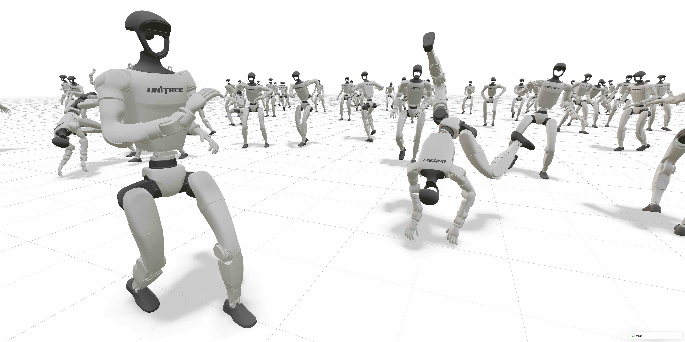

Welcome to mjlab!
=================

mjlab is a lightweight, open-source framework for robot learning that
combines GPU-accelerated simulation with composable environments and minimal
setup friction. It adopts the manager-based API introduced by
`Isaac Lab <https://github.com/isaac-sim/IsaacLab>`_, where users compose
modular building blocks for observations, rewards, and events, and pairs it
with `MuJoCo Warp <https://github.com/google-deepmind/mujoco_warp>`_ for
GPU-accelerated physics. The result is a framework installable with a single
command, requiring minimal dependencies, and providing direct access to
native `MuJoCo <https://github.com/google-deepmind/mujoco>`_ data
structures.

**Key features:**

- **Composable environments:** users define observations, rewards,
  terminations, and other MDP terms as modular building blocks
- **Minimal dependencies:** single-command install via ``uv``, low startup
  latency
- **Direct MuJoCo data structures:** native ``MjModel``/``MjData`` access
  with no translation layers
- **PyTorch-native:** observations, rewards, and actions are PyTorch
  tensors backed by zero-copy GPU memory sharing

For more on the design decisions behind mjlab, see :doc:`source/motivation`.

**Try it now** (no installation needed):

.. code-block:: bash

   uvx --from mjlab --refresh demo

Table of Contents
-----------------

.. toctree::
   :maxdepth: 1
   :caption: User Guide

   source/installation
   source/tutorials
   source/contributing

.. toctree::
   :maxdepth: 1
   :caption: Concepts

   source/architecture_overview
   source/entity/index
   source/actuators
   source/sensors/index
   source/scene
   source/terrain

.. toctree::
   :maxdepth: 1
   :caption: The Manager Layer

   source/environment_config
   source/observations
   source/actions
   source/rewards
   source/terminations
   source/commands
   source/events
   source/randomization
   source/curriculum
   source/metrics

.. toctree::
   :maxdepth: 1
   :caption: Training & Debugging

   source/training/rsl_rl
   source/viewers
   source/training/distributed_training
   source/training/cloud
   source/debugging/nan_guard
   source/debugging/export_scene

.. toctree::
   :maxdepth: 2
   :caption: API Reference

   source/api/index

.. toctree::
   :maxdepth: 1
   :caption: Further Reading

   source/motivation
   source/migration_isaac_lab
   source/faq
   source/research
   source/changelog

License & citation
------------------

mjlab is licensed under the Apache License, Version 2.0.
Please refer to the `LICENSE file <https://github.com/mujocolab/mjlab/blob/main/LICENSE/>`_ for details.

If you use mjlab in your research, we would appreciate a citation:

.. code-block:: bibtex

    @article{Zakka_mjlab_A_Lightweight_2026,
        author = {Zakka, Kevin and Liao, Qiayuan and Yi, Brent and Le Lay, Louis and Sreenath, Koushil and Abbeel, Pieter},
        title = {{mjlab: A Lightweight Framework for GPU-Accelerated Robot Learning}},
        url = {https://arxiv.org/abs/2601.22074},
        year = {2026}
    }

Acknowledgments
---------------

mjlab would not exist without the excellent work of the Isaac Lab team, whose API design
and abstractions mjlab builds upon.

Thanks also to the MuJoCo Warp team — especially Erik Frey and Taylor Howell — for
answering our questions, giving helpful feedback, and implementing features based
on our requests countless times.
