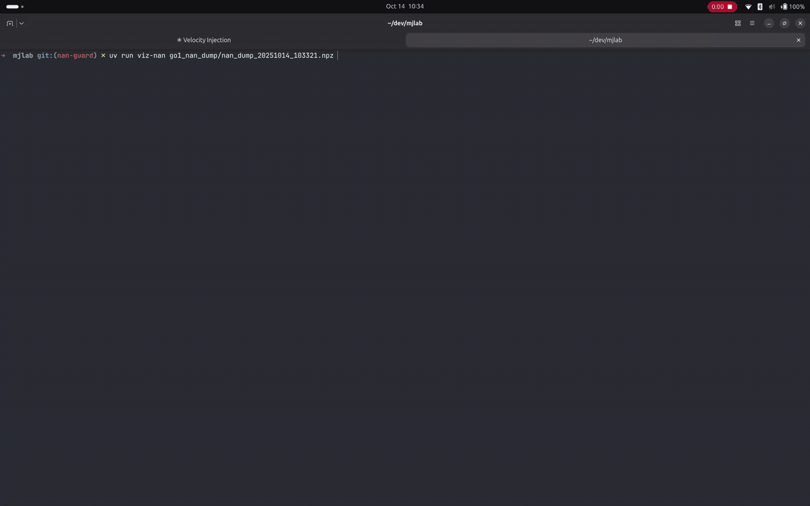

.. _nan-guard:

NaN Guard
=========

The NaN guard captures simulation states when NaN/Inf is detected, helping
debug numerical instability issues.

Quick start
-----------

Enable the NaN guard with a single CLI flag:

.. code-block:: bash

    uv run train <task-name> --enable-nan-guard True

This automatically captures and saves simulation states when NaN/Inf is
detected. You can also enable it programmatically:

.. code-block:: python

    from mjlab.sim.sim import SimulationCfg
    from mjlab.utils.nan_guard import NanGuardCfg

    cfg = SimulationCfg(
        nan_guard=NanGuardCfg(
            enabled=True,
            buffer_size=100,
            output_dir="/tmp/mjlab/nan_dumps",
            max_envs_to_dump=5,
        ),
    )

Configuration
-------------

``enabled`` *(default: False)*
    Enable/disable NaN detection and dumping.

``buffer_size`` *(default: 100)*
    Number of recent simulation states to keep in the rolling buffer.

``output_dir`` *(default: "/tmp/mjlab/nan_dumps")*
    Directory where NaN dump files are saved.

``max_envs_to_dump`` *(default: 5)*
    Maximum number of NaN environments to dump to disk. All environments are
    tracked in the buffer, but only the first N are saved to reduce dump
    size.

Behavior
--------

- **Captures** simulation state before each step (``qpos``, ``qvel``,
  ``act`` if the model has actuator activations, and ``mocap_pos``/``mocap_quat``
  if the model has mocap bodies)
- **Detects** NaN/Inf in ``qpos``, ``qvel``, ``qacc``,
  ``qacc_warmstart``, and ``sensordata`` after each step
- **Dumps** the rolling buffer and model to disk on first detection
- **Stops** after the first dump to avoid spam

When disabled, all operations are no-ops with negligible overhead.

Output format
-------------

Each NaN detection creates timestamped files plus latest symlinks:

- ``nan_dump_TIMESTAMP.npz``: compressed state buffer

  - ``states_step_NNNNNN``: captured states per step
    (shape: ``[num_envs_dumped, state_size]``)
  - ``_metadata``: dict with ``num_envs_total``, ``nan_env_ids``,
    ``dumped_env_ids``, etc.

- ``model_TIMESTAMP.mjb``: MuJoCo model in binary format
- ``nan_dump_latest.npz``: symlink to most recent dump
- ``model_latest.mjb``: symlink to most recent model

Visualizing dumps
-----------------

Use the interactive viewer to scrub through captured states:

.. code-block:: bash

    # View latest dump.
    uv run viz-nan /tmp/mjlab/nan_dumps/nan_dump_latest.npz

    # View a specific dump.
    uv run viz-nan /tmp/mjlab/nan_dumps/nan_dump_20251014_123456.npz

   NaN debug viewer.

The viewer provides:

- Step slider to scrub through the buffer
- Environment slider to compare different environments
- Info panel showing which environments have NaN/Inf
- 3D visualization of the robot and terrain at each state

NaN detection termination
-------------------------

While the NaN guard helps **debug** NaN issues by capturing states, you can
also **prevent** training crashes using the ``nan_detection`` termination
term. This marks NaN environments as terminated, allowing them to reset
while training continues:

.. code-block:: python

    from mjlab.envs.mdp.terminations import nan_detection
    from mjlab.managers.termination_manager import TerminationTermCfg

    nan_term: TerminationTermCfg = field(
        default_factory=lambda: TerminationTermCfg(
            func=nan_detection,
            time_out=False,
        )
    )

Terminations are logged as ``Episode_Termination/nan_term`` in your metrics.

.. important::

   ``nan_detection`` is a band-aid, not a cure. If NaNs occur during your
   task objective (e.g., NaNs happen when grasping), the policy will never
   learn to complete the task since it resets before receiving rewards.
   Monitor your ``Episode_Termination/nan_term`` metrics carefully.

**When to use which:**

- ``nan_guard``: debug and understand why NaNs occur (always do this first)
- ``nan_detection``: keep training stable while working on a permanent fix
