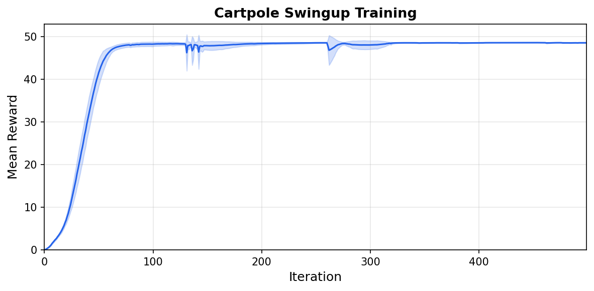

.. _tutorial-cartpole:

Cartpole: Building Your First Environment
=========================================

This tutorial walks through building a cartpole swingup task from scratch.
A cart slides along a rail with a pole attached by a hinge. The agent
applies force to the cart to swing the pole up and balance it.

.. raw:: html

   <video style="width:80%; display:block; margin:0 auto;" autoplay loop muted playsinline>
     <source src="../../_static/tutorials/cartpole_swingup.mp4" type="video/mp4">
   </video>
   

     A trained agent performing the swingup task.
   

The entire task lives in two files: an XML model and a Python module. We
will build both piece by piece, then snap them together at the end.

The XML model
-------------

Every environment starts with a MuJoCo XML that defines the physical
system. For cartpole that means two bodies, two joints, and one motor:

.. code-block:: xml

    <!-- A cart on a rail with a pole attached by a hinge. -->
    <body name="cart" pos="0 0 1">
      <joint name="slider" type="slide" axis="1 0 0"
             limited="true" range="-1.8 1.8" damping="5e-4"/>
      <geom name="cart" type="box" size="0.2 0.15 0.1" mass="1"/>
      <body name="pole_1" childclass="pole">
        <joint name="hinge_1"/>
        <geom name="pole_1"/>
      </body>
    </body>

    <!-- A motor that pushes the cart along the rail. -->
    <actuator>
      <motor name="slide" joint="slider" gear="10"
             ctrllimited="true" ctrlrange="-1 1"/>
    </actuator>

The motor has gear ratio 10 and control range [-1, 1], so the maximum
force is 10 N. ``ctrllimited`` tells MuJoCo to clamp the control signal
internally, so policy outputs outside this range are safe.

The full XML is at ``src/mjlab/tasks/cartpole/cartpole.xml``.

Building the environment
------------------------

Everything else lives in a single file, ``cartpole_env_cfg.py``. An
mjlab environment is made of small, composable pieces. We will define
each piece, then assemble them into a complete config at the end.

Entity: wrapping the XML
^^^^^^^^^^^^^^^^^^^^^^^^

An entity is a simulated object in the scene. It can be anything from a
static table to an articulated robot. The ``EntityCfg`` wraps a MuJoCo
XML and, optionally, actuator and initial state configurations. At
runtime, the entity exposes simulation data (joint positions, velocities,
etc.) as batched PyTorch tensors.

The cartpole is an articulated entity with one actuator, so we need a
function that loads the XML, an actuator configuration, and an initial
state.

.. code-block:: python

    # Load the XML.
    _CARTPOLE_XML = Path(__file__).parent / "cartpole.xml"

    def _get_spec() -> mujoco.MjSpec:
        return mujoco.MjSpec.from_file(str(_CARTPOLE_XML))

    # Tell mjlab to use the motor defined in the XML as is.
    _CARTPOLE_ARTICULATION = EntityArticulationInfoCfg(
        actuators=(XmlMotorActuatorCfg(target_names_expr=("slider",)),),
    )

The initial joint state depends on the task variant:

.. tab-set::

   .. tab-item:: Swingup

      The pole starts pointing down (``hinge = pi``). The agent must swing
      it up and balance it.

      .. code-block:: python

          _SWINGUP_INIT = EntityCfg.InitialStateCfg(
              joint_pos={"slider": 0.0, "hinge_1": math.pi},
              joint_vel={".*": 0.0},
          )

   .. tab-item:: Balance

      The pole starts upright (``hinge = 0``). The agent only needs to
      keep it balanced.

      .. code-block:: python

          _BALANCE_INIT = EntityCfg.InitialStateCfg(
              joint_pos={"slider": 0.0, "hinge_1": 0.0},
              joint_vel={".*": 0.0},
          )

Now we can snap these together into an ``EntityCfg``:

.. code-block:: python

    # Bundle the spec loader, actuator, and initial state into one config.
    def _get_cartpole_cfg(swing_up: bool = False) -> EntityCfg:
        return EntityCfg(
            spec_fn=_get_spec,
            articulation=_CARTPOLE_ARTICULATION,
            init_state=_SWINGUP_INIT if swing_up else _BALANCE_INIT,
        )

That is the entity done. Later, we will pass it to the scene so the
environment knows what to simulate.

Observations: what the agent sees
^^^^^^^^^^^^^^^^^^^^^^^^^^^^^^^^^

Each observation term is a function that reads from the simulation and
returns a tensor. The observation manager concatenates them into a single
vector for the policy. mjlab provides common terms in ``mjlab.envs.mdp``
(joint positions, velocities, etc.), but you can always define your own.

The cartpole has two moving parts, so its physical state is fully
described by two positions and two velocities:

.. list-table::
   :header-rows: 1
   :widths: 22 12 66

   * - Term
     - Dim
     - Description
   * - ``cart_pos``
     - 1
     - Where is the cart on the rail?
   * - ``pole_angle``
     - 2
     - Which way is the pole pointing? (cosine and sine)
   * - ``cart_vel``
     - 1
     - How fast is the cart moving?
   * - ``pole_vel``
     - 1
     - How fast is the pole rotating?

.. tip::

   The pole angle is encoded as cosine and sine rather than a raw angle.
   MuJoCo's unlimited hinge does not wrap the angle, so as the pole
   spins the raw value keeps growing. Cosine and sine give the same
   output for the same physical angle regardless of how many rotations
   have occurred.

This is the one custom observation function:

.. code-block:: python

    def pole_angle_cos_sin(env, asset_cfg) -> torch.Tensor:
        asset: Entity = env.scene[asset_cfg.name]
        angle = asset.data.joint_pos[:, asset_cfg.joint_ids]
        return torch.cat([torch.cos(angle), torch.sin(angle)], dim=-1)

.. note::

   All data in mjlab is batched: tensors have shape
   ``[num_envs, ...]`` because many environments run in parallel.
   Every function you write should accept and return tensors with this
   leading batch dimension.

To wire these up, we create ``ObservationTermCfg`` entries and group
them. ``SceneEntityCfg`` scopes each function to specific joints on
the entity:

.. code-block:: python

    cart_cfg = SceneEntityCfg("cartpole", joint_names=("slider",))
    hinge_cfg = SceneEntityCfg("cartpole", joint_names=("hinge_1",))

    cart_pos = ObservationTermCfg(
        func=joint_pos_rel, params={"asset_cfg": cart_cfg},
    )
    pole_angle = ObservationTermCfg(
        func=pole_angle_cos_sin, params={"asset_cfg": hinge_cfg},
    )
    cart_vel = ObservationTermCfg(
        func=joint_vel_rel, params={"asset_cfg": cart_cfg},
    )
    pole_vel = ObservationTermCfg(
        func=joint_vel_rel, params={"asset_cfg": hinge_cfg},
    )

Each term pairs a function with the parameters to call it with. Now
we group them. The RL algorithm expects an ``"actor"`` and ``"critic"``
group; they share the same terms here, but when you add noise later
you can give the critic clean observations
(asymmetric actor-critic [#aac]_).

.. code-block:: python

    actor_terms = {
        "cart_pos": cart_pos,
        "pole_angle": pole_angle,
        "cart_vel": cart_vel,
        "pole_vel": pole_vel,
    }

    observations = {
        "actor": ObservationGroupCfg(actor_terms),
        "critic": ObservationGroupCfg({**actor_terms}),
    }

Actions: what the agent does
^^^^^^^^^^^^^^^^^^^^^^^^^^^^

The agent outputs a single scalar: the force on the cart.
``JointEffortActionCfg`` writes the policy output to the actuator's
effort target. The ``XmlMotorActuator`` passes it to MuJoCo's ``ctrl``
buffer, which clamps it to [-1, 1] and multiplies by the gear ratio:

.. code-block:: python

    actions = {
        "effort": JointEffortActionCfg(
            entity_name="cartpole",
            actuator_names=("slider",),
            scale=1.0,
        ),
    }

Rewards: the training signal
^^^^^^^^^^^^^^^^^^^^^^^^^^^^

Each reward term is a function that returns a scalar per environment.
The reward manager computes a weighted sum of all terms each step.

The cartpole reward reproduces dm_control's smooth reward as a single
multiplicative term:

.. math::

   r = \underbrace{\frac{\cos\theta + 1}{2}}_{\text{upright}}
       \times \underbrace{\frac{1 + g(x)}{2}}_{\text{centered}}
       \times \underbrace{\frac{4 + q(u)}{5}}_{\text{small control}}
       \times \underbrace{\frac{1 + g(\dot\theta)}{2}}_{\text{small velocity}}

Each factor is between 0 and 1. The product is high only when all four
conditions hold simultaneously, preventing the agent from trading off
one factor against another.

.. code-block:: python

    rewards = {
        "smooth_reward": RewardTermCfg(
            func=cartpole_smooth_reward,
            weight=1.0,
            params={"cart_cfg": cart_cfg, "hinge_cfg": hinge_cfg},
        ),
    }

Terminations: when to stop
^^^^^^^^^^^^^^^^^^^^^^^^^^

The cartpole has no failure states, so the only termination is a time
limit. Setting ``time_out=True`` tells the RL algorithm this is a
truncation, not a true terminal state, so it bootstraps the value
function past the episode boundary:

.. code-block:: python

    terminations = {
        "time_out": TerminationTermCfg(func=time_out, time_out=True),
    }

Events: resetting the state
^^^^^^^^^^^^^^^^^^^^^^^^^^^

At the start of each episode, reset events randomize joint positions and
velocities around the initial state we defined in the entity:

.. code-block:: python

    events = {
        "reset_slider": EventTermCfg(
            func=reset_joints_by_offset,
            mode="reset",
            params={
                "position_range": (-0.1, 0.1),
                "velocity_range": (-0.01, 0.01),
                "asset_cfg": SceneEntityCfg("cartpole", joint_names=("slider",)),
            },
        ),
        "reset_hinge": EventTermCfg(
            func=reset_joints_by_offset,
            mode="reset",
            params={
                "position_range": (-0.034, 0.034),
                "velocity_range": (-0.01, 0.01),
                "asset_cfg": SceneEntityCfg("cartpole", joint_names=("hinge_1",)),
            },
        ),
    }

The offsets are relative to the entity's initial state. For swingup the
hinge starts at pi, so the noise keeps it near pointing down.

Snapping everything together
^^^^^^^^^^^^^^^^^^^^^^^^^^^^

``ManagerBasedRlEnvCfg`` is where all the pieces come together. The
scene holds the entity, and the config holds everything else:

.. code-block:: python

    return ManagerBasedRlEnvCfg(
        scene=SceneCfg(
            terrain=TerrainEntityCfg(terrain_type="plane"),
            entities={"cartpole": _get_cartpole_cfg(swing_up=swing_up)},
            num_envs=1,
            env_spacing=4.0,
        ),
        observations=observations,
        actions=actions,
        events=events,
        rewards=rewards,
        terminations=terminations,
        sim=SimulationCfg(
            mujoco=MujocoCfg(timestep=0.01, disableflags=("contact",)),
        ),
        decimation=5,
        episode_length_s=50.0,
    )

``decimation=5`` means the physics runs five substeps per policy step,
giving a 20 Hz control frequency. ``disableflags=("contact",)`` skips
contact computation since cartpole has no collisions. ``num_envs=1`` is
the default; override it from the CLI with ``--num-envs``.

Registration and training
-------------------------

The last step is to register the task so it can be launched by name.
Each registration pairs an environment config with an RL config that
specifies the network architecture and PPO hyperparameters. For cartpole
a small network of two 64 unit hidden layers is plenty. The full RL
config is in ``cartpole_env_cfg.py`` alongside the environment config.

This goes in ``__init__.py``:

.. code-block:: python

    register_mjlab_task(
        task_id="Mjlab-Cartpole-Swingup",
        env_cfg=cartpole_swingup_env_cfg(),
        play_env_cfg=cartpole_swingup_env_cfg(play=True),
        rl_cfg=cartpole_ppo_runner_cfg(),
    )

Train:

.. code-block:: bash

    uv run train Mjlab-Cartpole-Swingup --num-envs 4096

Play back a trained checkpoint, either from a local file or a W&B run:

.. code-block:: bash

    uv run play Mjlab-Cartpole-Swingup --checkpoint-file logs/rsl_rl/cartpole/model_500.pt
    uv run play Mjlab-Cartpole-Swingup --wandb-run-path <user/project/run_id>

   Mean reward over 5 seeds (shaded: one standard deviation).

Config fields can be overridden from the CLI:

.. code-block:: bash

    uv run train Mjlab-Cartpole-Swingup \
        --num-envs 8192 \
        --agent.algorithm.learning-rate 3e-4 \
        --agent.algorithm.entropy-coef 0.005

Next steps
----------

**Add observation noise.** The current config has no noise, so the
policy is brittle. Add noise to any observation term to train a more
robust policy:

.. code-block:: python

    from mjlab.utils.noise import UniformNoiseCfg

    ObservationTermCfg(
        func=joint_pos_rel,
        params={"asset_cfg": cart_cfg},
        noise=UniformNoiseCfg(n_min=-0.05, n_max=0.05),
    )

**Randomize the physics.** Use the :ref:`domain_randomization` system
to vary pole mass or joint damping across environments, training a
policy that transfers across physical variations.

**Explore other tasks.** The library ships with locomotion,
manipulation, and motion tracking tasks you can run out of the box:
``Mjlab-Velocity-Flat-Unitree-Go1``, ``Mjlab-Lift-Cube-Yam``, and
``Mjlab-Tracking-Flat-Unitree-G1``, among others. Reading their source
shows how more complex observation and reward structures are composed.

**Build something new.** The cartpole is intentionally minimal. Once
you are comfortable with the pieces, try designing your own robot model
and task from scratch. The same pattern applies regardless of how
complex the system becomes.

.. rubric:: References

.. [#aac] Pinto, L., Andrychowicz, M., Welinder, P., Zaremba, W., & Abbeel, P. (2018). `Asymmetric Actor Critic for Image-Based Robot Learning <https://www.roboticsproceedings.org/rss14/p08.pdf>`_. *Robotics: Science and Systems XIV*.
