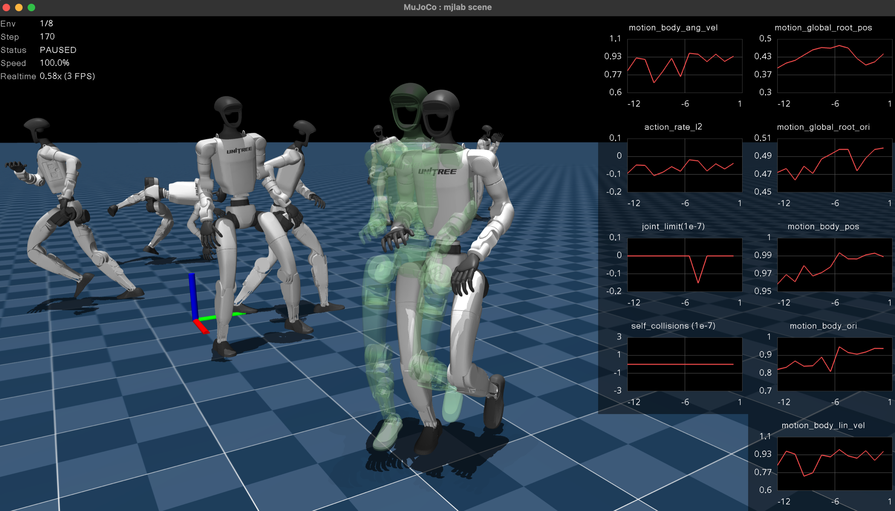
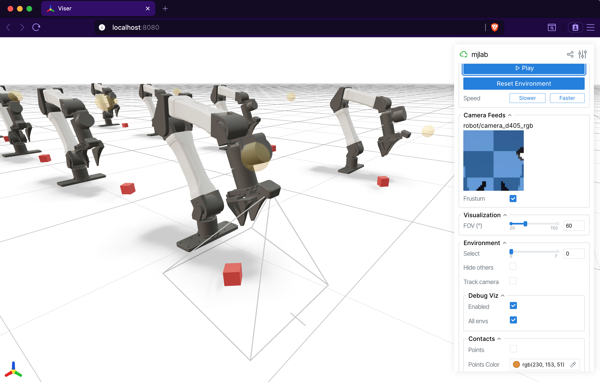

.. _viewers:

Viewers
=======

mjlab ships two interactive viewers for evaluating trained policies and
debugging environment behavior: a **native viewer** built on MuJoCo's
`passive viewer <https://mujoco.readthedocs.io/en/stable/python.html#passive-viewer>`_
that opens a desktop window, and a `Viser <https://viser.studio/main/>`_ **viewer** that runs in the
browser. Both share a common ``ViewerConfig`` and execute the same
simulation loop; they differ in interface, feature set, and where they
shine.

Launching a viewer
------------------

The ``play`` script accepts a ``--viewer`` flag:

.. code-block:: bash

    # Desktop window (MuJoCo native viewer).
    uv run play Mjlab-Velocity-Flat-Unitree-G1 --viewer native \
        --wandb-run-path your-entity/your-project/run_id

    # Browser-based viewer (opens localhost:8080).
    uv run play Mjlab-Velocity-Flat-Unitree-G1 --viewer viser \
        --wandb-run-path your-entity/your-project/run_id

The default is ``auto``, which selects native when a display server is
available (``DISPLAY`` or ``WAYLAND_DISPLAY``) and falls back to Viser
on headless machines.

For quick exploration without a trained checkpoint, pass ``--agent zero``
or ``--agent random`` to use a dummy policy:

.. code-block:: bash

    uv run play Mjlab-Velocity-Flat-Unitree-G1 --agent zero --viewer viser

Viewer configuration
--------------------

Camera position, tracking target, and rendering options live in
``ViewerConfig``, set through the ``viewer`` field of
``ManagerBasedRlEnvCfg``:

.. code-block:: python

    from mjlab.viewer import ViewerConfig

    viewer = ViewerConfig(
        lookat=(0.0, 0.0, 0.5),
        distance=3.0,
        elevation=-20.0,
        azimuth=135.0,
    )

The ``origin_type`` field controls the camera reference frame:

.. list-table::
   :header-rows: 1
   :widths: 22 78

   * - Origin type
     - Behavior
   * - ``WORLD``
     - Free camera anchored at world origin (default).
   * - ``ASSET_ROOT``
     - Camera tracks the root body of the entity named by
       ``entity_name``. Good for locomotion tasks where the robot moves
       through the world.
   * - ``ASSET_BODY``
     - Camera tracks a specific body (``body_name``) within the entity
       named by ``entity_name``. Useful for close-up views of an
       end-effector or head.

Example with asset tracking:

.. code-block:: python

    viewer = ViewerConfig(
        origin_type=ViewerConfig.OriginType.ASSET_ROOT,
        entity_name="robot",
        distance=2.5,
        elevation=-15.0,
    )

Additional fields:

- ``enable_shadows`` and ``enable_reflections`` toggle rendering
  quality.
- ``height`` and ``width`` set the offscreen render resolution (used
  by ``OffscreenRenderer`` and video recording).
- ``env_idx`` selects which environment to display at startup.

Native MuJoCo viewer
---------------------

The native viewer opens MuJoCo's
`passive viewer <https://mujoco.readthedocs.io/en/stable/python.html#passive-viewer>`_
in a desktop window. It provides the fastest, most faithful rendering
with full MuJoCo visual fidelity. Choose this viewer for local
iteration and interactive perturbation testing. The
MuJoCo team has a
`video tutorial <https://www.youtube.com/watch?v=P83tKA1iz2Y>`_
covering the viewer's built-in controls and navigation.

**Keyboard controls.**

.. list-table::
   :header-rows: 1
   :widths: 18 82

   * - Key
     - Action
   * - ``Space``
     - Pause or resume simulation.
   * - ``Enter``
     - Reset the environment.
   * - ``+`` / ``-``
     - Increase or decrease playback speed.
   * - ``<`` / ``>``
     - Cycle through environments (when ``num_envs > 1``).
   * - ``A``
     - Toggle rendering all environments simultaneously. Debug
       visualization draws for all environments when this is active.
   * - ``P``
     - Toggle reward plots.
   * - ``R``
     - Toggle debug visualization.

**Reward plots.**
Press ``P`` to display per-term reward curves in a strip along the right
edge of the window. Each term gets its own plot with an autoscaling
y-axis. The plots update live and clear on environment reset. This is
the fastest way to diagnose which reward terms dominate or misbehave
during a rollout.

**Interactive perturbations.**
Click and drag any body in the scene to apply external forces during
playback. The force transfers into the simulation on the next step,
making it easy to test balance recovery, grasp robustness, or
disturbance rejection without writing any code.

Mouse perturbation forces are kept separate from programmatic forces
(e.g. ``apply_body_impulse``) by routing them through different MuJoCo
channels: programmatic forces use ``xfrc_applied`` (Cartesian body
forces), while mouse forces are converted to ``qfrc_applied``
(generalized joint forces) via ``mj_applyFT``. Both channels are summed
during forward dynamics, so they coexist without conflict.

**Domain randomization visualization.**
The native viewer syncs all visual DR fields from GPU to CPU each
frame. Randomized geom colors, sizes, positions, material colors,
body poses, camera parameters, light positions, and inertia ellipsoids
all render faithfully. If a DR event changes a visual property, the
native viewer shows it.

Viser (browser-based)
---------------------

The `Viser <https://viser.studio/main/>`_ viewer opens an interactive 3D scene
in the browser at ``localhost:8080``. It works on remote machines over
SSH tunnels, making it the natural choice for headless GPU servers and
shared debugging sessions. Its web-based architecture makes it far more customizable than the
native viewer. It also provides dedicated panels for camera sensor
output that the native viewer does not.

**Tab-based interface.**
The sidebar organizes controls into tabs:

- **Controls**: play/pause, reset, speed adjustment, environment
  selection, and display settings (FOV, contacts, geom groups, camera
  tracking).
- **Rewards**: live per-term reward charts, toggled by a checkbox.
- **Metrics**: live per-term metric charts when a ``MetricsManager``
  is present.
- **Camera Feeds**: live RGB and depth image panels for every
  ``CameraSensor`` in the scene. A depth scale slider adjusts the
  visualization range, and a frustum toggle draws the camera's field of
  view in the 3D scene.
- **Groups**: show or hide MuJoCo geom and site groups.

**Camera sensor integration.**
Viser auto-discovers all ``CameraSensor`` instances in the scene and
displays their output as live image panels. Each camera also gets a
frustum visualization in the 3D viewport, so you can see exactly what
the sensor covers. This makes Viser the best tool for debugging camera
placement, field of view, and depth sensing.

**Contact visualization.**
The Controls tab exposes contact rendering options. When enabled, contact
points appear as colored markers and contact forces as red arrows,
giving immediate visual feedback on collision behavior.

.. note::

   The Viser viewer does not support interactive perturbations (applying
   wrenches to bodies). Use the native viewer for that, or set up
   perturbations via :ref:`events <events>`.

.. note::

   Viser reads world-space body positions directly from GPU each frame,
   so body poses update correctly. However, ``geom_rgba`` and
   ``geom_size`` are baked into GLB meshes at scene construction time
   and will not reflect per-world DR changes. This will be addressed in
   a future release. For now, use the native viewer when you need to
   verify visual DR.

Debug visualization
-------------------

Both viewers support a shared ``DebugVisualizer`` interface that manager
terms can draw into. Available primitives:

- **Arrows**: velocity commands, force vectors, heading indicators.
- **Spheres**: target positions, contact points.
- **Cylinders**: limb targets, distance markers.
- **Ellipsoids**: inertia visualization.
- **Coordinate frames**: body frame orientation, end-effector targets.
- **Ghost meshes**: transparent renderings of a robot at a target pose,
  useful for motion tracking or goal visualization.

In the native viewer, toggle debug visualization with ``R`` and press
``A`` to show debug draws for all environments at once. In Viser, the
Controls tab has toggles for both. The ``DebugVisualizer`` abstraction
means that reward and command terms draw once, and both viewers display
the result without any viewer-specific code.

Offscreen renderer
------------------

For recording videos without a display, ``OffscreenRenderer`` renders
frames using MuJoCo's offscreen rendering pipeline. It supports the
same ``ViewerConfig`` camera configuration and accepts a debug
visualization callback. The renderer is hard-capped at 32 environments
to keep memory and rendering time manageable.

The ``play`` script uses ``OffscreenRenderer`` when the ``--video`` flag
is set:

.. code-block:: bash

    uv run play Mjlab-Velocity-Flat-Unitree-G1 --video --video-length 300 \
        --wandb-run-path your-entity/your-project/run_id

Quick comparison
----------------

.. list-table::
   :header-rows: 1
   :widths: 24 38 38

   * -
     - Native
     - Viser
   * - Interface
     - Desktop window
     - Browser (``localhost:8080``)
   * - Best for
     - Local iteration, perturbations
     - Customization, remote dev, cameras
   * - Reward plots
     - ``P`` key, right-side strip
     - Rewards tab, uPlot charts
   * - Metrics plots
     -
     - Metrics tab
   * - Camera feeds
     -
     - Auto-discovered, with frustum
   * - Perturbations
     - Click and drag
     -
   * - DR visualization
     - Full (all visual fields synced)
     - Partial (body poses only)
   * - Contact rendering
     -
     - Contact points and forces
   * - Multi-environment
     - ``<`` ``>`` to cycle, ``A`` for all
     - Dropdown selector

Citation
--------

If you use the Viser viewer in your research, consider citing:

.. code-block:: bibtex

    @article{yi2025viser,
        title={Viser: Imperative, web-based 3d visualization in python},
        author={Yi, Brent and Kim, Chung Min and Kerr, Justin and Wu, Gina and Feng, Rebecca and Zhang, Anthony and Kulhanek, Jonas and Choi, Hongsuk and Ma, Yi and Tancik, Matthew and Kanazawa, Angjoo},
        journal={arXiv preprint arXiv:2507.22885},
        year={2025}
    }
